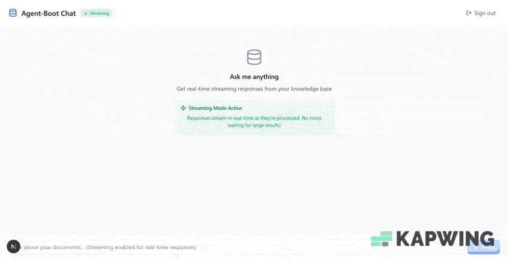

# 🚀 Agent Boot

**A production-ready, multi-language RAG system that supercharges Claude with domain-specific knowledge through intelligent document processing and semantic search.**

Agent Boot combines the performance of Go with the AI capabilities of Python, delivering a seamless AI-powered search experience through Claude's MCP (Model Context Protocol). Built on the powerful [go-api-boot](https://github.com/SaiNageswarS/go-api-boot) framework for type-safe, enterprise-grade applications.

[](https://golang.org/)
[](https://python.org/)
[](https://mongodb.com/)
[](https://azure.microsoft.com/)

##  Features

- **Blazing Fast**: Go-powered backend with gRPC services for maximum performance
- **Smart Processing**: Python-based ML pipeline for document understanding and entity extraction
- **Hybrid Search**: Vector + text search.
- **Real-time Streaming**: Live search results and AI responses through gRPC streaming
- **Production Performance**: Temporal workflows for scalable document processing and fast search with Go's performance.
- **Multi-tenant**: Secure, isolated environments per tenant
- **Claude Integration**: Native MCP agent for seamless AI interactions
- **Cloud Native**: Azure Blob Storage + MongoDB with auto-scaling
- **Intelligent Query Processing**: Chain-of-thought reasoning extracts optimal search queries from natural language

## 🏗️ Architecture

```
┌─────────────────┐    ┌──────────────────┐    ┌─────────────────┐
│   Claude + MCP  │───▶│   search-core    │───▶│   pySideCar     │
│     Agent       │    │   (Go Backend)   │    │ (Python ML/NLP) │
└─────────────────┘    └──────────────────┘    └─────────────────┘
                                │                       │
                                ▼                       ▼
                       ┌────────────────────────────────────────┐
                       │            **go-api-boot**             │
                       │(Bundled api-gRpc, ODM-Mongo (Search),  │
                       │         Workers-Temporal, az blob)     │
                       └────────────────────────────────────────┘

```

### 🎯 The Perfect Fusion

**Go Backend (`search-core`)**
- High-performance gRPC services
- Temporal workers for orchestration  
- Vector & text search endpoints
- Authentication & multi-tenancy
- Powered by [go-api-boot](https://github.com/SaiNageswarS/go-api-boot)

**Python ML Pipeline (`pySideCar`)**
- PDF → Markdown conversion (pymupdf4llm)
- Intelligent text chunking with sentence boundaries
- Advanced windowing strategies

**Claude MCP Agent (`mcp-agent`)**
- Real-time insights from document collections
- Seamless integration with Claude Desktop
- Context-aware query processing

Since Agent Boot is developed with go-api-boot, it serves gRPC (HTTP/2) and gRPC-Web (HTTP/1.1) out of the box.

## Real-time Streaming with go-api-boot
### Live AI Agent Responses


Agent Boot delivers real-time streaming responses through go-api-boot's gRPC infrastructure. Watch as your queries are processed live:

- Query Processing → Instant feedback
- Search Execution → Live search results streaming
- AI Analysis → Real-time answer generation
- Complete Response → Fully cited, intelligent answers

### Streaming Architecture Deep Dive

```go
// agent_service.go

func (s *AgentService) CallAgent(req *pb.AgentInput, stream grpc.ServerStreamingServer[pb.AgentStreamChunk]) error {
    // Helper function with automatic flushing
    sendChunk := func(chunk *pb.AgentStreamChunk) error {
        if err := stream.Send(chunk); err != nil {
            return err
        }
        // Force flush for real-time streaming
        if flusher, ok := stream.(interface{ Flush() error }); ok {
            flusher.Flush()
        }
        return nil
    }

    // Stream metadata updates
    sendMetadata("processing_input", 0, 0)
    
    // Stream search queries as they're generated
    sendChunk(&pb.AgentStreamChunk{
        ChunkType: &pb.AgentStreamChunk_SearchRequest{
            SearchRequest: &pb.SearchRequestChunk{
                Queries: agentInput.SearchQueries,
            },
        },
    })

    // Stream search results in real-time chunks
    for i := 0; i < totalResults; i += chunkSize {
        chunk := searchResults.Results[i:end]
        sendChunk(&pb.AgentStreamChunk{
            ChunkType: &pb.AgentStreamChunk_SearchResults{
                SearchResults: &pb.SearchResultsChunk{
                    Results: chunk,
                    ChunkIndex: int32(chunkIndex),
                },
            },
        })
    }

    // Stream final AI-generated answer
    sendChunk(&pb.AgentStreamChunk{
        ChunkType: &pb.AgentStreamChunk_Answer{
            Answer: &pb.AnswerChunk{
                Content: answer,
                IsFinal: true,
            },
        },
    })
}
```

Since Agent Boot is built with go-api-boot, it serves both gRPC (HTTP/2) and gRPC-Web (HTTP/1.1) out of the box, enabling streaming from web browsers and native applications.

## AI-Powered Intelligence

### Chain-of-Thought Reasoning

Agent Boot uses sophisticated prompting techniques for optimal results:

#### From extract_agent_search_query_system.md
**Chain of Thought Process:**

1. **Relevance Check**: Does this question fall within the agent's capability domain?
2. **Key Extraction**: What are the most important terms and concepts?
3. **Information Needs**: What would I need to know to answer this comprehensively?
4. **Search Strategy**: What queries would find the most relevant, authoritative information?
5. **Diversity**: Do my queries cover different aspects without too much overlap?

### Advanced Search Algorithm

```go
// From search_service.go - Hybrid scoring
const (
    vectorSearchWeight = 0.7
    textSearchWeight   = 0.3
    vecK  = 20  // Vector search results
    textK = 20  // Text search results
    maxChunks = 20
)

// Intelligent score combination
for id, score := range textSearchChunkScoreMap {
    combinedScores[id] = score * textSearchWeight
}
for id, score := range vecSearchChunkScoreMap {
    combinedScores[id] += score * vectorSearchWeight
}
```

### Multi-Tenant Architecture
Agent Boot provides complete tenant isolation across all layers:

#### Database Level
```go
// From auth interceptor - automatic tenant extraction
_, tenant := auth.GetUserIdAndTenant(ctx)

// Each tenant gets isolated collections
chunkCollection := odm.CollectionOf[db.ChunkModel](s.mongo, tenant)
```

#### Storage Level
```go
// From activities - tenant-specific blob containers
func (s *Activities) InitTenant(ctx context.Context, tenant string) error {
    // Each tenant gets its own Azure Blob Container
    if err := s.az.EnsureBucket(ctx, tenant); err != nil {
        return err
    }
}
```

#### Processing Level
```python
# From pySideCar - tenant-aware document processing
async def convert_pdf_to_md(self, tenant: str, pdf_file_name: str) -> str:
    pdf_file_path = self._azure_storage.download_file(tenant, pdf_file_name)
    # Process within tenant context
```

## Powered by go-api-boot
Agent Boot leverages [SaiNageswarS/go-api-boot](https://github.com/SaiNageswarS/go-api-boot) for enterprise-grade development:

### Type-Safe Development
```go
// from main.go
// Automatic dependency injection with type safety
boot, err := server.New().
    GRPCPort(":50051").
    HTTPPort(":8081").
    Provide(ccfgg).                    // Config injection
    Provide(az).                       // Azure client
    Provide(claude).                   // LLM client
    Provide(mongoClient).              // Database
    // Temporal workflow registration
    WithTemporal(ccfgg.TemporalGoTaskQueue, &temporalClient.Options{
        HostPort: ccfgg.TemporalHostPort,
    }).
    RegisterTemporalActivity(activities.ProvideActivities).
    RegisterTemporalWorkflow(workflows.ChunkMarkdownWorkflow).
    // gRPC service registration
    RegisterService(server.Adapt(pb.RegisterSearchServer), services.ProvideSearchService).
    Build()
```

### Enterprise Features
- Automatic gRPC/HTTP servers with middleware support
- MongoDB ODM with vector search capabilities
- Azure Cloud Integration for storage and secrets
- JWT Authentication with tenant isolation
- Temporal Workflows for reliable processing
- Configuration Management with environment support
- Structured Logging with correlation IDs

### Developer Experience
The entire application wiring happens in ~50 lines of clean, type-safe code. No configuration files, no dependency injection containers - just pure Go with compile-time safety.

## 🚀 Quick Start

### Prerequisites

- Go 1.24+
- Python 3.11+
- MongoDB with Vector Search
- Azure Blob Storage
- Temporal.io cluster

### 1. Clone & Setup

```bash
git clone https://github.com/your-org/agent-boot
cd agent-boot

# Setup Go backend
cd search-core
go mod download
```

### 2. Environment Configuration

```bash
# .env file
MONGODB_URI=mongodb://localhost:27017
AZURE_STORAGE_ACCOUNT=your_account
AZURE_STORAGE_KEY=your_key
TEMPORAL_HOST_PORT=localhost:7233
ANTHROPIC_API_KEY=your_key
JINA_API_KEY=your_key
SEARCH_CORE_AUTH_TOKEN=your_token
```

### 3. Generate Protocol Buffers

```bash
cd proto
./build.sh
```

### 4. Start the Backend

```bash
cd search-core
go run main.go
```

### 5. Launch Python ML Worker

```bash
cd pySideCar
pip install -r requirements.txt
python main.py
```

### 6. Setup MCP Agent

```bash
cd mcp-agent
go run main.go
```

Add to your Claude Desktop config:
```json
{
  "mcpServers": {
    "agent-boot": {
      "command": "./mcp-agent",
      "args": []
    }
  }
}
```

## 📖 Usage

### Document Processing

Upload a PDF to trigger the complete processing pipeline:

```bash
# Upload document
curl -X POST http://localhost:8080/upload \
  -H "Authorization: Bearer $JWT_TOKEN" \
  -F "file=@research_paper.pdf" \
  -F "tenant=healthcare"
```

The system automatically:
1. **Converts** PDF → Markdown
2. **Chunks** into logical sections
3. **Extracts** medical entities (UMLS)
4. **Embeds** using Jina AI
5. **Indexes** for hybrid search

### Querying with Claude

Simply ask Claude health-related questions:

> "What are the latest treatments for Type 2 diabetes?"

The MCP agent will:
- Process your query
- Search the knowledge base
- Return relevant journal insights with citations

### Direct API Access

```bash
# Search endpoint
curl -X POST http://localhost:50051/search \
  -H "Authorization: Bearer $JWT_TOKEN" \
  -d '{
    "queries": ["diabetes treatment", "insulin resistance"]
  }'
```

## 🔧 Configuration

### Search Core (`config.ini`)

```ini
[dev]
sign_up_allowed = true
vector_search_enabled = true
text_search_enabled = true
temporal_host_port = localhost:7233
temporal_py_task_queue = searchCorePySideCar
```

### Python Sidecar

```python
# Enhanced medical entity processing
MEDICAL_ENTITIES = "medical_entities"

# Configure chunking parameters
WINDOW_SIZE = 700      # Max tokens per chunk
STRIDE = 600          # Overlap between chunks
MIN_SECTION_BYTES = 4000  # Minimum section size
```

## 🔒 Security & Multi-tenancy

- **JWT Authentication**: Secure API access
- **Tenant Isolation**: Complete data separation
- **Azure Integration**: Enterprise-grade security
- **Input Validation**: Comprehensive request sanitization

## 🛠️ Development

### Project Structure

```
agent-boot/
├── search-core/          # Go backend services
│   ├── services/         # gRPC implementations  
│   ├── workers/          # Temporal activities
│   └── db/              # MongoDB models
├── pySideCar/           # Python ML pipeline
│   └── workers/         # Document processing
├── mcp-agent/           # Claude MCP integration
└── proto/               # Protocol buffer definitions
```

### Adding New Domains

1. **Define Enhancement**: Add to `indexer_types.py`
2. **Create Processor**: Implement entity extraction logic
3. **Update Workflow**: Modify `window_section_chunks` activity
4. **Configure Search**: Adjust indexing parameters

### Testing

```bash
# Go tests
cd search-core && go test ./...

# Python tests  
cd pySideCar && python -m pytest

# Integration tests
make test-integration
```

## 🤝 Contributing

We welcome contributions! Please follow these steps:

1. Fork the repository
2. Create a feature branch
3. Add tests for new functionality
4. Submit a pull request

## 📄 License

This project is licensed under the MIT License - see the [LICENSE](LICENSE) file for details.

## 🙏 Acknowledgments

- **[go-api-boot](https://github.com/SaiNageswarS/go-api-boot)**: The fantastic Go framework powering our backend
- **Temporal.io**: Workflow orchestration
- **Anthropic**: Claude AI integration
- **Ollama**: Vector embeddings

---

**Built with ❤️ for the AI-powered future**